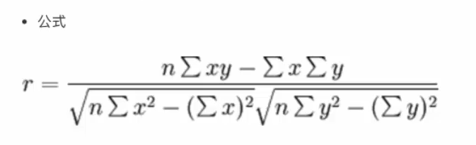

# 机器学习概述

### 数据集的构成

1. 特征值 + 目标值

### 机器学习算法分类

1. 监督学习：有目标值
   1. 目标值：类别 - 分类问题
   2. 目标值：连续型数据 - 回归问题

2. 无监督学习：无目标值

### 机器学习开发流程

1. 获取数据
2. 数据处理
3. 特征工程
4. 机器学习算法训练 - 模型
5. 模型评估
6. 应用

# `scikit-learn` 

### `sklearn`数据集的使用

1. `sklearn.datasets`

   - 导入例：`from sklearn.datasets import load_iris`

   - `*`表示是某一个数据集的名字

   - `datasets.load_*`  获取小规模数据集，数据包含在datasets里
   - `datasets.fetch_*(data_home=None, subest="")`  获取大规模数据集
     - 参数`data_home`表示数据集的下载目录，默认在家目录下的`scikit_learn_data`
     - 参数`subest="train"训练集, "test"测试集, "all"两者的全部`

   - 数据集的返回值
     - 数据类型：`datasets.base.Bunch`(继承自字典)  拥有字典的特征和自己的特征
     - 拥有5个键
       1. `data`：特征数据数组 -- 特征值
       2. `target`：标签数组 -- 目标值
       3. `DESCR`：数据描述 -- 对数据集的描述
       4. `feature_names`：特征名 -- 每一个特征的字段
       5. `target_names`：标签名 -- 每一个目标代表什么
     - 可以通过点属性的方式来获得值
       1. 如：`bunch.data`

### 数据集划分

- 导入例：`from sklearn.model_selection import train_test_split`

- `return = sklearn.model_selection.train_test_split(x, y, test_size, random_state)`
  - `x`：数据集的特征值
  - `y`：数据集的标签值
  - `test_size`：测试集的大小，一般为float，表示占比，默认为0.25
  - `random_state`：随机数种子
  - `return`：返回值，顺序为  训练集特征值、测试集特征值、训练集目标值、测试机目标值。常用命名为：`x_tarin, x_test, y_train, y_test` x表示特征值，y表示目标值
    - 例：`x_train, x_test, y_train, y_test = train_test_split(iris.data, iris.target, test_size=0.2, random_state=22)`

### 特征工程

#### 特征提取

- `sklearn.feature_extraction`
- sparse矩阵自带方法`toarray()`
  - 将sparse矩阵转化为常规矩阵

#### 字典特征提取

- 导入例：`from sklearn.feature_extraction import DictVectorizer`
  - `sklearn.feature_extraction.DictVectorizer(sparse=True)`
    - 参数`sparse`：默认True，表示稀疏矩阵
      - 稀疏矩阵：将非零值按位置表示出来，用于节省内存，提高加载效率
    - `DictVectorizer.fit_transform(X)`
      - X：字典或包含字典的迭代器
      - 返回值：返回sparse矩阵
    - `DictVectorizer.inverse_transform(X)`
      - X：array数组或者sparse矩阵
      - 返回值：转化之前的数据格式
    - `DictVectorizer.get_feature_names()`   
      - 返回类别名称

#### 文本特征提取

- 导入例：`from sklearn.feature_extraction.text import CountVectorizer`
  - `sklearn.feature_extraction.text.CountVectorizer(stop_words=[])`
    - `CountVectorizer.fit_transform(X)`
      - X：文本或包含文本字符串的可迭代对象
      - 返回值：返回sparse矩阵
    - `CountVectorizer.inverse_transform(X)`
      - X：array数组或者sparse矩阵
      - 返回值：转化之前的数据格式
    - `CountVectorizer.get_feature_names()`
      - 返回值：单词列表
    - `stop_words`参数
      - 停用词，传入不记录特征提取的词

#### 中文文本特征提取

1. `jieba`分词
   - 导入：`import jieba`
   - 方法：`jieba.cut(text)`
     - text：需要进行分词的中文文本

#### 文本特征抽取`TfidVevtorizer`    

1. 关键词：在某一个类别的文章中，出现的次数很多，但是在其他类别文章中出现的很少。

2. `Tf-idf`作用：用以评估一字词对于一个文件集或一资料库中的某一份文件的重要程度

   - `Tf`：词频，指的是某一个给定的词语在该文件中出现的频率
   - `idf`：逆向文本频率，是一个词语普遍重要性的度量。某一特定词语的`idf`，可以由总文件数目除以包含该词语之文件的数目，再将得到的商取以10为底的对数得到最终得出的结果可以理解为重要程度。

   - `Tf-idf`：运算，`Tf * idf`

     - 例：语料库中有1000篇文章，1000篇文章中有100篇出现了`'经济'`一词。

       文章A(100词)：出现10次`'经济'`

       `tf` = `10 / 100 = 0.1`

       `idf` = `lg 1000 / 10 = 2`

       `Tf-idf = 0.2`

3. `API`

   - `sklearn.feature_extraction.text.TfidfVectorizer(stop_words=None)`

   - 返回值的权重矩阵

     - `TfidfVectorizer.fit_transform(X)`
       - X：文本或者包含文本字符串的可迭代对象
       - 返回值：返回sparse矩阵

     - `TfidfVectorizer.inverse_transform(X)`
       - X：array数组或者sparse矩阵
     - `TfidfVectorizer.get_feature_names()`
       - 返回值：单词列表

#### 特征预处理——无量纲化

###### 归一化

- `from sklearn.preprocessing import MinMaxScaler`
  - `sklearn.preprocessing.MinMaxScaler(feature_range=())`
    - `feature_range`：默认(0, 1)
  - `MinMaxScaler.fit_transform(X)`
    - X：`numpy array`格式的数据`[n_samples, n_features]`
  - 返回值：转化后形状相同的array

1. 定义：通过对原始数据进行变化把数据映射到(默认为[0, 1])之间

2. 公式

   

###### 标准化

- `from sklearn.preprocessing import StandardScaler`
  - `sklearn.preprocessing.StandardScaler`
    - 处理之后，对每列来说，所有数据都聚集在均值为0附近，标准差为1
    - `StandardScaler.fit_transform(X)`
      - X：`numpy array`格式的数据`[n_samples, n_features]`
    - 返回值：转化后形状相同的array

1. 定义：通过对原始数据进行变换把数据变换到均值为0，标准差为1范围内
2. 公式

###### 总结

- 对于归一化来说：如果出现异常点，影响了最大值和最小值，那么结果显然会发生改变
- 对于标准化来说：如果出现异常点，由于具有一定数据量，少量的异常点对于平均值的影响并不大，从而方差改变较小

#### 特征降维

##### 特征选择

定义：降维是指在某些限定条件下，降低随机变量（特征）个数，得到一组“不相关”主变量的过程

1. `Filter`过滤式：
   - 方差选择法：低方差过滤
   - 相关系数
2. `Embeded`嵌入式
   - 决策树
   - 正则化
   - 深度学习

###### `Filter`过滤式

1. 方差选择法
   1. API

      - ​	`sklearn.feature_selection.VarianceThreshold(threshold = 0.0)`

      - `threshold`：方差临界值，默认为0	

      - `Variance.fit_transform(X)`

      - X：`numpy array`格式的数据`[n_samples, n_features]`

      - 返回值：保留高于`threshold`临界值方差的样本特征

2. 相关系数———皮尔逊相关系数

   - 公式

     

   - 特点

     

   - API

     ​	

     - 使用方法`pearsonr(第一个数据，第二个数据)`

     - 该方法返回的多个值中，第一个值为相关系数

##### 主成分分析（PCA）

- API

  

